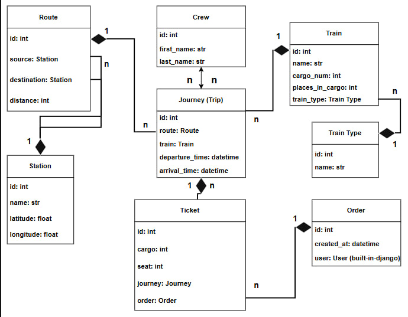

# Train Station API

A robust API service for managing a train station, built with Django REST Framework. This project provides a complete backend solution for scheduling journeys, managing crew, and booking tickets.

## Key Features
- **Resource Management**: Manage stations, train types, and train fleets.
- **Journey Planning**: Create routes between stations and schedule journeys with specific departure and arrival times.
- **Crew Management**: Assign crew members to journeys using many-to-many relationships.
- **Booking System**: An order-based ticket purchasing system.
- **Performance**: Optimized database queries using select_related and prefetch_related for faster API response times.

## Database Schema

## Getting Started

### Local Setup
1. Clone the repository:
   git clone https://github.com/kronev1i/train-station-api.git
2. Install dependencies:
   pip install -r requirements.txt
3. Run migrations and start the server:
   python manage.py migrate
   python manage.py runserver

### Docker Setup
You can run the entire project in a containerized environment with a single command:
docker-compose up --build

## API Access
Once the server is running, navigate to: http://127.0.0.1:8000/api/station/
The Browsable API allows you to interact with all endpoints directly from your browser.
